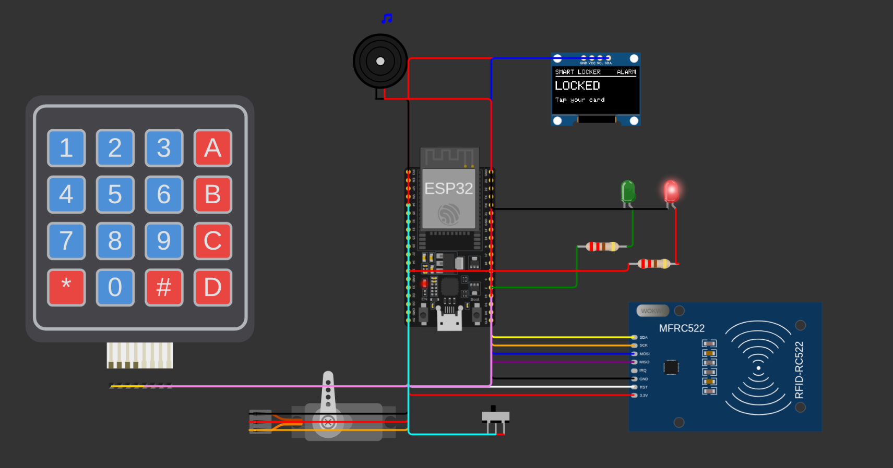
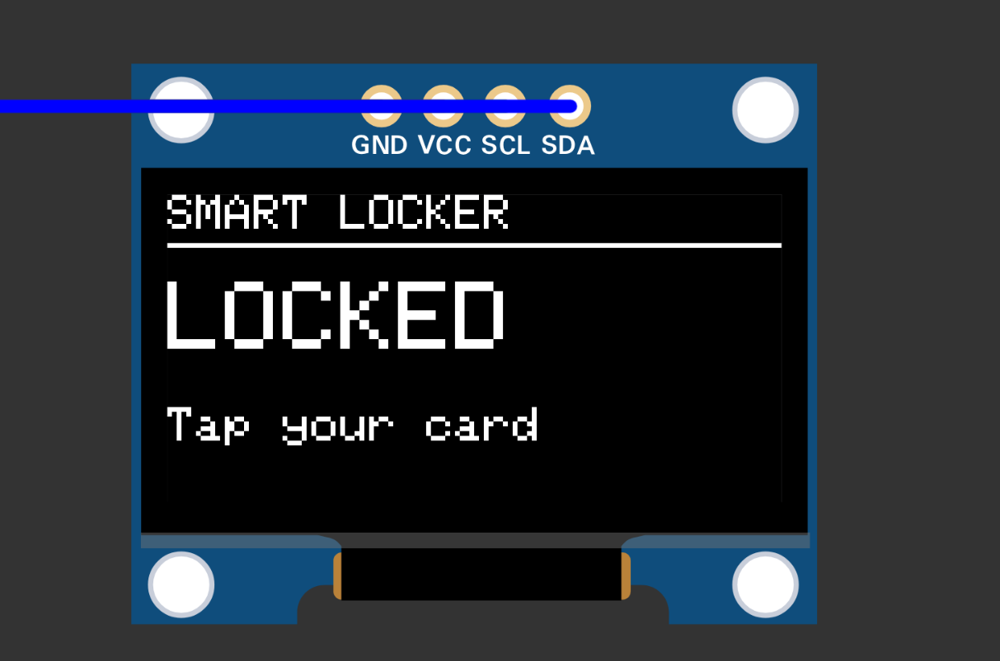
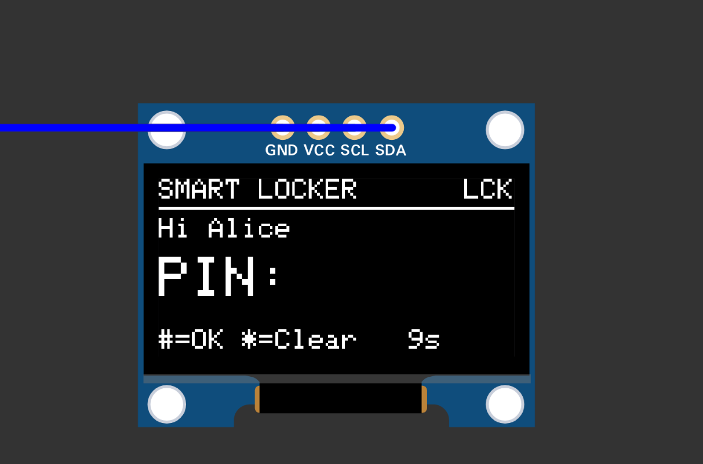
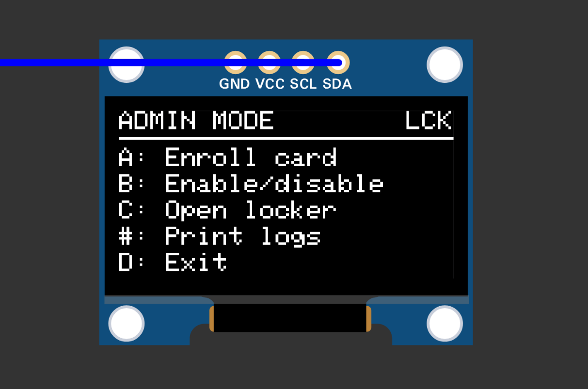
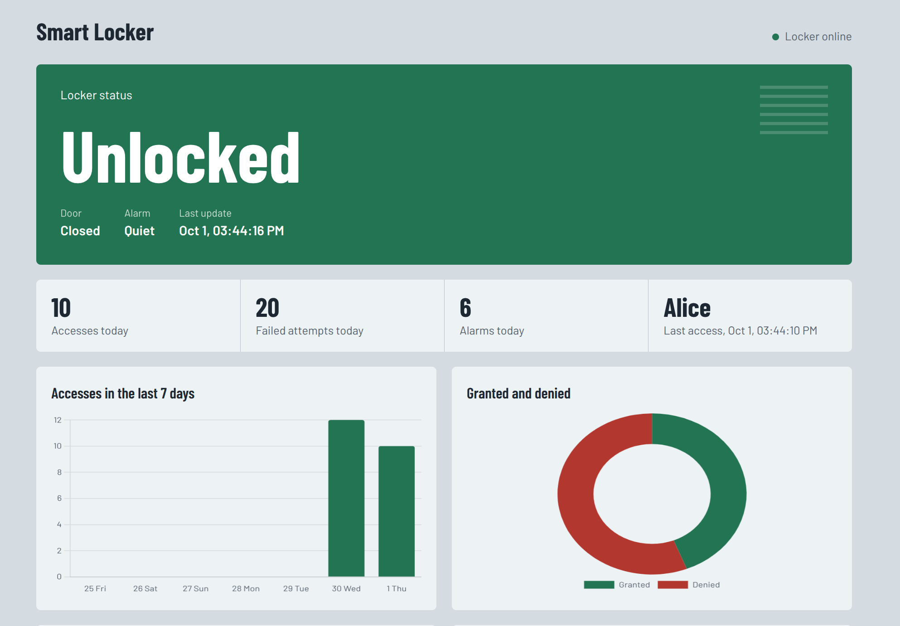
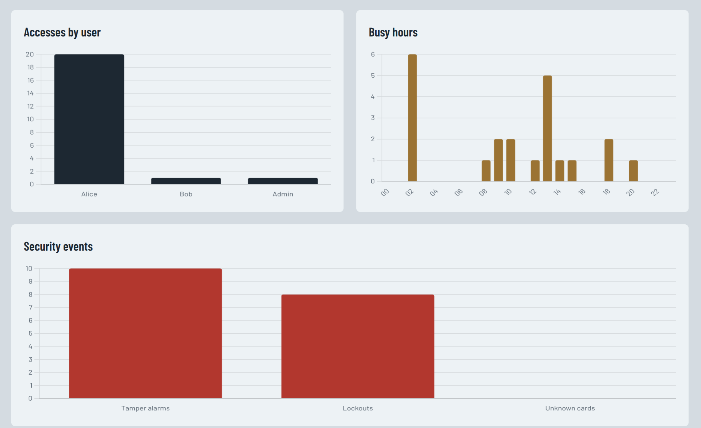
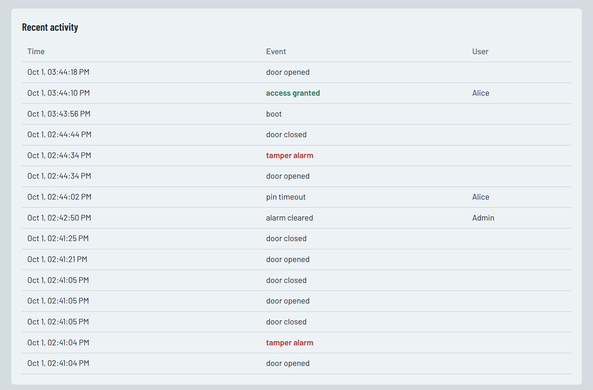
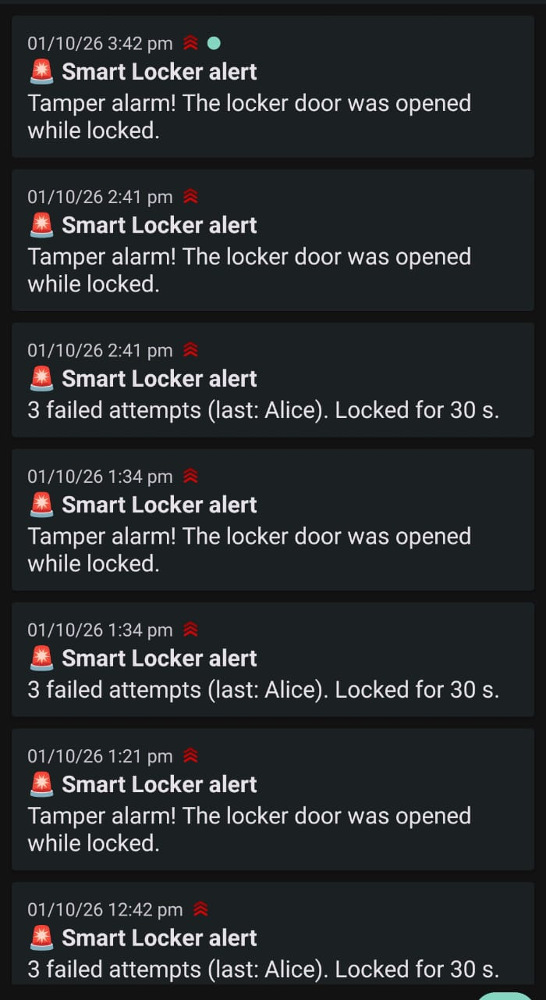
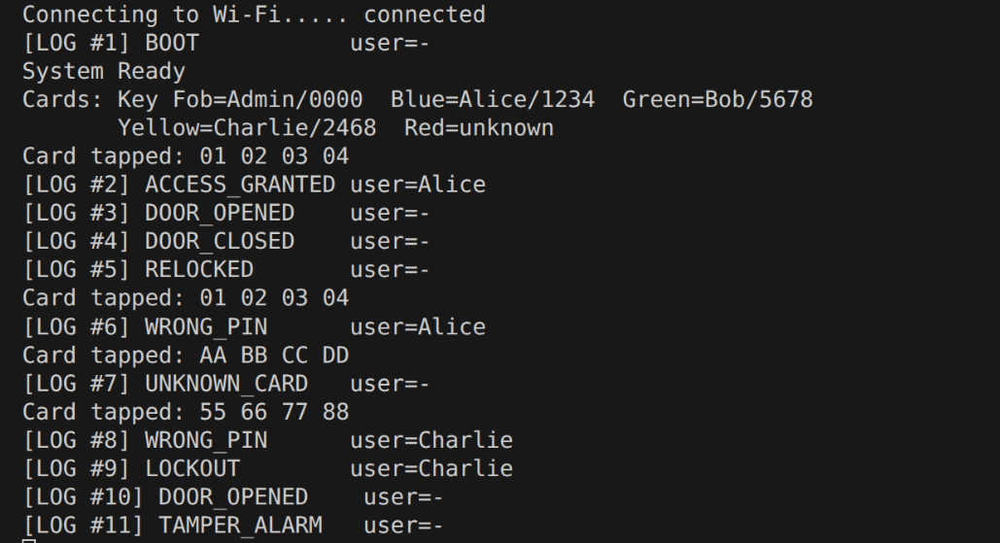

# Smart Locker & Access Monitoring System



An ESP32 smart locker written in procedural C. It unlocks with an **RFID card + PIN**, logs every event, raises a **tamper alarm** if the door is forced, sends **phone alerts**, and shows live statistics on a **web dashboard**. The whole circuit runs in the **Wokwi** simulator inside VS Code, so no hardware is needed to try it.

## Features

- **Two-factor access:** tap an RFID card, then enter a 4-digit PIN (`#` to submit, `*` to clear)
- **Lockout** for 30 s after 3 failed attempts in a row
- **Auto-relock** 1 s after the door closes, or after 10 s if it is never opened
- **Tamper alarm** if the door opens while locked; cleared by a valid user
- **Admin mode:** enrol a card, enable/disable a user, open the locker, print the log
- **Access log** kept as a linked list in RAM (newest 20) and a CSV file in flash (every entry, when the file system is available)
- **Real timestamps** from the internet (NTP)
- **Cloud sync** to Firebase Realtime Database; entries made while offline are uploaded later
- **Phone alerts** for tamper and lockout events via [ntfy](https://ntfy.sh)
- **Web dashboard** with live status and five charts

## Screenshots

### Locker (OLED)

| Idle | PIN entry | Admin menu |
|---|---|---|
|  |  |  |

### Web dashboard







### Phone alerts and serial log

<p>
  
  &nbsp;
  
</p>

## Hardware

| Component | ESP32 pin |
|---|---|
| Servo (lock) | GPIO 13 (5V) |
| Buzzer | GPIO 15 |
| Door switch | GPIO 34 |
| Green / red LED (220 Ω) | GPIO 2 / GPIO 12 |
| RFID RC522 (SPI) | SDA/SS 5, SCK 18, MISO 19, MOSI 23, RST 27 |
| 4x4 keypad | Rows 32, 33, 25, 26 · Columns 14, 16, 17, 4 |
| SSD1306 OLED (I2C, 0x3C) | SDA 21, SCL 22 |

The full circuit is in `diagram.json`.

## Project structure

```
├── src/sketch.cpp          # locker program
├── diagram.json            # Wokwi circuit
├── platformio.ini          # board, framework and libraries
├── wokwi.toml              # Wokwi simulator settings
├── images/                 # screenshots for this README
└── dashboard/
    ├── firebase.json       # Firebase Hosting settings
    └── public/index.html   # dashboard (HTML, CSS, JavaScript, Chart.js)
```

## Getting started

### 1. Requirements

- [VS Code](https://code.visualstudio.com/) with the **PlatformIO IDE** and **Wokwi Simulator** extensions
- A free Wokwi license: press F1 → **Wokwi: Request a New License**
- Optional: a free [Firebase](https://console.firebase.google.com/) project and the [ntfy](https://ntfy.sh) phone app

### 2. Configure (optional cloud features)

The locker works without these; it simply runs offline.

1. In Firebase, create a project → **Build → Realtime Database → Create Database** → start in **test mode**.
2. Copy the database URL into both files:
   - `src/sketch.cpp` → `FIREBASE_URL`
   - `dashboard/public/index.html` → `FIREBASE_URL`
3. In `src/sketch.cpp`, set `NTFY_TOPIC` to a long, hard-to-guess name, and subscribe to the same topic in the ntfy app.

### 3. Build and run

1. Open the project folder in VS Code.
2. Click **Build** (the check mark in the bottom bar) and wait for SUCCESS.
3. Press F1 → **Wokwi: Start Simulator**.

PlatformIO installs the libraries automatically: Keypad, ESP32Servo, Adafruit GFX, Adafruit SSD1306 and MFRC522.

### 4. Try it

| Wokwi card | User | PIN |
|---|---|---|
| Key Fob | Admin | 0000 |
| Blue | Alice | 1234 |
| Green | Bob | 5678 |
| Yellow | Charlie | 2468 |
| Red | Not registered | Enrol it to Guest in admin mode (PIN 1111) |

In admin mode: `A` enrol a card, `B` enable/disable a user, `C` open, `#` print the log, `D` exit.

### 5. Dashboard (optional)

Open `dashboard/public/index.html` in a browser, or host it with Firebase Hosting:

```bash
cd dashboard
npx firebase-tools deploy --only hosting --project YOUR-PROJECT-ID
```

## How it works

**State machine.** The locker is always in one of seven states: Idle, Wait PIN, Unlocked, Lockout, Admin Menu, Admin Pick and Admin Card. Each pass of `loop()` collects inputs into an `Event`, checks the door, and calls the current state's handler through an array of function pointers:

```c
state_table[state](&ev);
```

**Cloud.** Every 2 seconds the ESP32 does one job: send a waiting phone alert, upload the oldest unsent log entry (`POST /logs`), or update the live status (`PUT /status`). Cloud work pauses while someone is typing.

```
/logs     { n, t, event, user }       one entry per event
/status   { locked, alarm, door, t }  current state
```

**Dashboard.** Reads `/logs` and `/status` every 3 seconds, calculates statistics in the browser, and draws charts with Chart.js. The locker is shown as offline if no status arrives for 20 seconds.

## Code overview

| # | Section | C concepts |
|---|---|---|
| 1 | Libraries & preprocessor | `#define`, macro with parameters, conditional compilation |
| 2 | Data types | `typedef`, union, structures, enums, function pointer type |
| 3 | Hardware objects | 2D array |
| 4 | Global data | `static` storage class, array of structures, circular queue |
| 5 | Function prototypes | Declarations |
| 6 | Helpers | Strings, pointer arithmetic |
| 7 | Users | Pointers to structures, recursive binary search |
| 8 | Access log | `malloc`/`free`, linked list, file handling, recursion |
| 9 | Lock control | `strcmp`, ternary operator |
| 10 | Reading inputs | Call by reference |
| 11 | State handlers | State machine, `switch`, array of function pointers |
| 12 | Outputs | LEDs, buzzer, OLED |
| 13 | Cloud | HTTPS requests, JSON with `snprintf` |
| 14 | `setup()` / `loop()` | Main program |

The file is `.cpp` because the Arduino framework on the ESP32 compiles as C++ and the hardware libraries are C++. The locker logic itself is written in plain procedural C.

## Limitations

- Firebase test mode lets anyone with the URL read and write; add security rules before real use.
- PINs are stored as plain text.
- Users and admin changes are kept in RAM and reset on restart.
- Only 4-byte RFID cards are supported.
- Without Wi-Fi at start-up, timestamps are 0 and cloud sync stays off until restart.
- HTTPS certificate checking is skipped (`setInsecure()`), for simulation only.
- In the Wokwi simulator the flash file system may not start ("File system not available"); the locker then skips the log file and keeps working with the in-memory log and Firebase.

## Ideas for improvement

- Firebase authentication and security rules
- Hashed PINs
- Store users and pending uploads in flash
- Automatic Wi-Fi reconnect
- DS3231 real-time clock
- Support for 7-byte cards
- Fingerprint sensor
